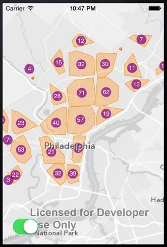

clusterlayer-plugin-ios
=======================

A cluster layer extension to the [ArcGIS Runtime for iOS](https://developers.arcgis.com/ios/).

The gridding code is based heavily on [Leaflet.markercluster](https://github.com/Leaflet/Leaflet.markercluster/blob/master/src/DistanceGrid.js)



##Usage
1. Import `AGSClusterLayer.h`
2. Add an `AGSFeatureLayer` to the `AGSMapView`
3. Create an `AGSClusterLayer` with the `AGSFeatureLayer` and add it to the `AGSMapView`
``` ObjC
#import "AGSClusterLayer.h"

#define kGreyBasemap @"http://services.arcgisonline.com/ArcGIS/rest/services/Canvas/World_Light_Gray_Base/MapServer"
#define kGreyBasemapRef @"http://services.arcgisonline.com/ArcGIS/rest/services/Canvas/World_Light_Gray_Reference/MapServer"

- (void)viewDidLoad
{
    [super viewDidLoad];

    [self.mapView addMapLayer:[AGSTiledMapServiceLayer tiledMapServiceLayerWithURL:[NSURL URLWithString:kGreyBasemap]]];

    AGSFeatureLayer *featureLayer = [AGSFeatureLayer featureServiceLayerWithURL:[NSURL URLWithString:kFeatureLayerURL] mode:AGSFeatureLayerModeOnDemand];
    [self.mapView addMapLayer:featureLayer];
    
    self.clusterLayer = [AGSClusterLayer clusterLayerForFeatureLayer:featureLayer];
    [self.mapView addMapLayer:self.clusterLayer];

    self.clusterLayer.showClusterCoverages = self.coverageSwitch.on; // By default, coverages are not shown
}
```
